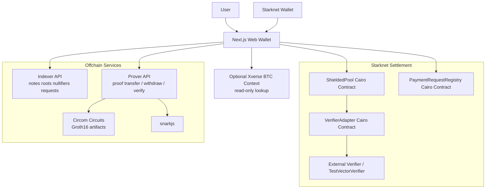

# Sssh BTC Wallet

A Starknet-first confidential wallet prototype for private BTC-value transfers using ZK proofs.

This project was built for the Re{define} Hackathon (Privacy + Bitcoin on Starknet).

## What This Project Is (and Is Not)

- `Is`: a privacy-focused wallet flow on Starknet using a BTC-like asset (default `tBTC`) and shielded notes.
- `Is`: proof-verified private transfer and withdrawal flows with a hackathon-grade verifier adapter boundary.
- `Is`: a strong demo narrative for Bitcoin + privacy on Starknet.
- `Is not`: native Bitcoin L1 settlement in the current demo.
- `Is not`: Bitcoin signing or Bitcoin transaction broadcasting through Xverse.

### Architecture boundary (important for demos)

This demo uses:
- `Starknet settlement` for deposit / private transfer / withdrawal flows
- `Read-only Bitcoin context` (optional Xverse API lookup) for BTC narrative and wallet context

## Core Features

- Private deposits into a Starknet `ShieldedPool`
- ZK proof-verified private transfers with nullifier checks
- Private withdrawals from the shielded pool to a public Starknet address
- Private payment request flow with hidden amount commitments
- Prover API for transfer/withdraw proof generation and verification
- Indexer API for roots, notes, nullifiers, and payment requests
- Optional read-only Xverse BTC context panel in the web app

## Project Flow Diagram



Additional sequence diagrams (deposit / private transfer / withdraw) are in `/docs/flow-diagrams.md`.

## Repository Structure

- `/apps/web` - Next.js wallet UI and API routes (including optional Xverse context proxy)
- `/services/indexer` - in-memory/json-backed indexer for commitments, roots, nullifiers, requests
- `/services/prover` - proof generation + verification API (Groth16 via `snarkjs`)
- `/packages/shared` - shared crypto helpers, constants, and TypeScript types
- `/contracts` - Cairo contracts (`ShieldedPool`, `VerifierAdapter`, `PaymentRequestRegistry`, `TestVectorVerifier`)
- `/circuits` - Circom circuits and proving artifacts build scripts
- `/scripts` - bootstrap, demo, smoke test, proof vector, deploy scripts
- `/docs` - architecture, threat model, protocol notes, demo script, deployment records

## Tech Stack

- `Next.js 15` / React 19 (web app)
- `TypeScript` (web + services + shared package)
- `Express` + `zod` (API services)
- `Circom` + `snarkjs` (proof generation)
- `Cairo` + `Scarb` + `starkli` (Starknet contracts + deployment)

## Requirements

### Required for local development

- Node.js 22+
- npm 10+

### Required for proving artifacts (real proofs)

- `circom >= 2.1.8`
- `npx snarkjs` (installed via project deps)

### Required for contract work / deployment

- `scarb`
- `starkli`

## Quick Start (Local Demo)

```bash
./scripts/bootstrap.sh
./scripts/setup-zk-artifacts.sh
npm run dev
```

Services:
- Web: `http://localhost:3000`
- Indexer: `http://localhost:4100`
- Prover: `http://localhost:4200`

### One-command demo launcher

```bash
./scripts/demo.sh
```

This starts indexer/prover/web and prints health checks + log file locations.

## Smoke Test

```bash
./scripts/smoke-test.sh
```

This validates the private flow path (including `/transfers/private`) using `scripts/private-flow-smoke.mjs`.

## Environment Configuration

### Web app (`/apps/web/.env.local`)

Start from `/apps/web/.env.example`.

Key variables:
- `NEXT_PUBLIC_INDEXER_URL`
- `NEXT_PUBLIC_PROVER_URL`
- `NEXT_PUBLIC_STARKNET_NETWORK`
- `NEXT_PUBLIC_STARKNET_RPC_URL`
- `NEXT_PUBLIC_DEFAULT_ASSET`
- `NEXT_PUBLIC_SHIELDED_POOL_ADDRESS`
- `NEXT_PUBLIC_VERIFIER_ADAPTER_ADDRESS`
- `NEXT_PUBLIC_PAYMENT_REQUEST_REGISTRY_ADDRESS`
- `NEXT_PUBLIC_EXTERNAL_VERIFIER_ADDRESS`
- `NEXT_PUBLIC_TEST_VECTOR_ADMIN_ADDRESS`
- `NEXT_PUBLIC_REGISTER_TEST_VECTOR_DIGESTS`

Optional Xverse read-only context:
- `XVERSE_API_BASE_URL`
- `XVERSE_BALANCE_URL_TEMPLATE`
- `XVERSE_API_KEY` (optional)

If Xverse config is missing, the web API route returns a clear `configured: false` response instead of failing.

### Indexer (`/services/indexer/.env`)

Start from `/services/indexer/.env.example`.

- `PORT`
- `SSSH_BTC_INDEXER_STATE_FILE`

### Prover (`/services/prover/.env`)

Start from `/services/prover/.env.example`.

- `PORT`
- `SSSH_BTC_MOCK_PROOFS`
- `SSSH_BTC_ZK_ARTIFACTS_DIR`

Optional explicit proof artifact overrides:
- `SSSH_BTC_TRANSFER_WASM`
- `SSSH_BTC_TRANSFER_ZKEY`
- `SSSH_BTC_TRANSFER_VKEY`
- `SSSH_BTC_WITHDRAW_WASM`
- `SSSH_BTC_WITHDRAW_ZKEY`
- `SSSH_BTC_WITHDRAW_VKEY`

Note: the code currently supports legacy `SHADOWBTC_*` env vars as a one-release compatibility fallback.

## API Overview

### Prover API (`/services/prover`)

- `GET /health`
- `POST /proof/transfer`
- `POST /proof/withdraw`
- `POST /proof/verify`

### Indexer API (`/services/indexer`)

- `GET /health`
- `GET /tree/root`
- `GET /notes/:walletHint`
- `GET /wallet/:walletHint/snapshot`
- `POST /commitments`
- `POST /nullifiers`
- `GET /nullifiers/:nullifier`
- `POST /notes/spend`
- `POST /transfers/private`
- `POST /withdrawals/private`
- `POST /payment-requests`
- `GET /payment-requests/:id`
- `POST /payment-requests/:id/pay`
- `POST /demo/mint-note`

## Demo Guidance (Judge-Friendly Positioning)

Use `/docs/demo-script.md` for the timed script.

Recommended phrasing:
- `Starknet settlement + read-only Bitcoin context`
- `Private BTC-value transfers on Starknet`

Avoid implying native Bitcoin settlement in the current demo.

## Proof Vector and Verifier Workflow

Generate proof vectors from a running prover:

```bash
node ./scripts/export-proof-vector.mjs transfer
node ./scripts/export-proof-vector.mjs withdraw
```

Compute digest for `TestVectorVerifier.register_digest`:

```bash
node ./scripts/compute-vector-digest.mjs ./docs/vectors/transfer-proof-bundle.json
```

## Contract Build and Deployment

### Build contracts

```bash
cd contracts
scarb build
scarb --release build
```

### Deploy skeleton (Sepolia)

```bash
./scripts/deploy-sepolia.sh
```

This script declares/deploys:
- `VerifierAdapter`
- `ShieldedPool`
- `PaymentRequestRegistry`
- optionally `TestVectorVerifier`

Useful deployment flags:
- `VERIFIER_MOCK_MODE=0` (external verifier mode)
- `DEPLOY_TEST_VECTOR_VERIFIER=1` (default)
- `EXTERNAL_VERIFIER_ADDRESS=<address>` (reuse an existing verifier)

## Security and Production Readiness Notes

This repository is hackathon-grade and intentionally not production-ready.

Current limitations / hardening roadmap:
1. Replace simplified root logic with full Poseidon Merkle inclusion proofs.
2. Upgrade simplified circuit relations (including nullifier/request-claim paths) to stronger constraints.
3. Replace `TestVectorVerifier` with a cryptographic Groth16 verifier contract.
4. Audit contracts, circuits, and service boundaries.
5. Add load testing and operational hardening for prover/indexer services.

See also:
- `/docs/threat-model.md`
- `/docs/privacy-guarantees-and-limits.md`

## Sensitive File Hygiene

This repo is configured to avoid committing common local secrets and machine-specific state.

Ignored by default (see `.gitignore`):
- `.env`, `.env.local`, `.env.*` (with `.env.example` explicitly allowed)
- `*.pem`, `*.key`, `*.p12`, `*.keystore`
- local caches/logs (`.next`, `dist`, `*.log`, `.local`, service caches/state folders)

Before pushing, verify you are not adding local env files:

```bash
git status --ignored
```

## Documentation Index

- `/docs/architecture.md` - high-level architecture overview
- `/docs/flow-diagrams.md` - detailed Mermaid flow/sequence diagrams
- `/docs/protocol.md` - protocol notes
- `/docs/threat-model.md` - hackathon threat model
- `/docs/privacy-guarantees-and-limits.md` - privacy scope and limitations
- `/docs/demo-script.md` - 3-minute demo script (judge flow)
- `/docs/deployments/` - recorded deployment notes and addresses
- `/docs/submission-description-500w.md` - hackathon submission summary

## Roadmap Ideas

- Native/bridge-integrated Bitcoin settlement path
- Production-grade Groth16 verifier integration
- Full Merkle tree and stronger anonymity set guarantees
- Better proof job queueing and prover observability
- Multi-wallet and richer merchant UX flows
