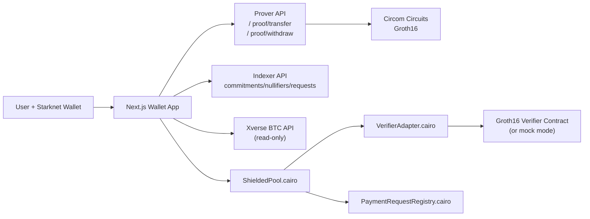

# Sssh BTC Wallet Architecture

Sssh BTC Wallet is organized as a Starknet-first confidential wallet stack with three execution layers:

1. Onchain Cairo contracts for state integrity and settlement.
2. Offchain proving/indexing services for UX and proof orchestration.
3. Web wallet for user interaction and demo narrative.

## Core data model

- Commitment: hash(owner, asset, amount, blinding).
- Nullifier: hash(commitment, sender secret).
- Root: rolling root today, Poseidon Merkle root in production upgrade.
- Ciphertext payload: encrypted note metadata shared offchain.

## Current hackathon mode

- Prover API defaults to real Groth16 witness/proof generation when circuit artifacts are present.
- Verifier adapter can still run in mock mode onchain during hackathon iteration.
- Endpoints and contracts already match final architecture so verifier hardening is isolated.
