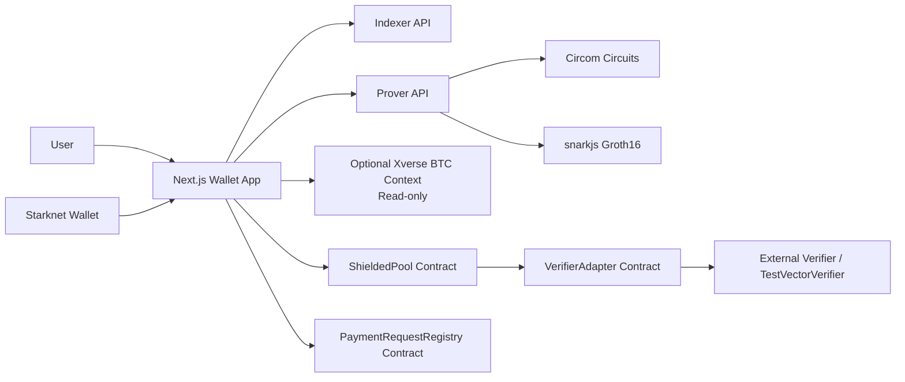
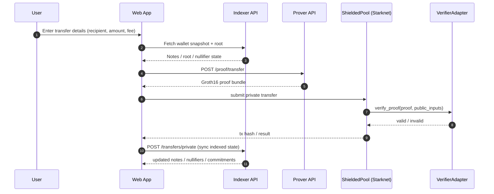
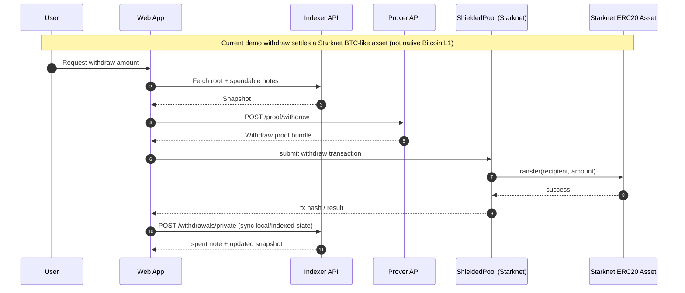
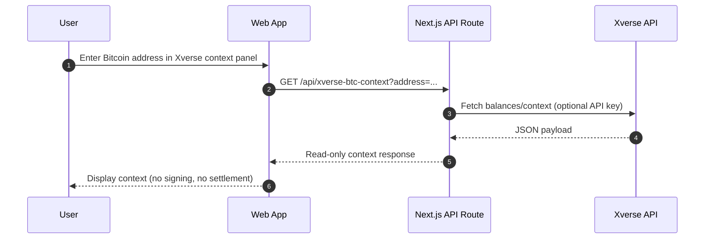

# Flow Diagrams

This file contains project flow diagrams for Sssh BTC Wallet.

## 1. System Architecture Flow

## 2. Private Transfer Flow (Demo Path)

## 3. Withdrawal Flow (Current Demo Semantics)

## 4. Optional Bitcoin Context (Read-only Xverse)

